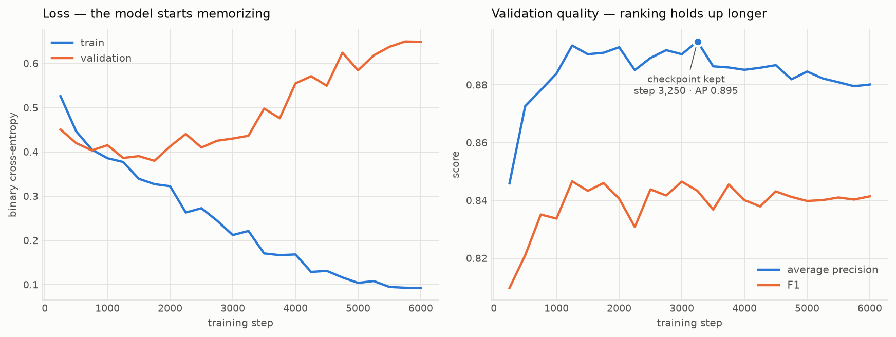
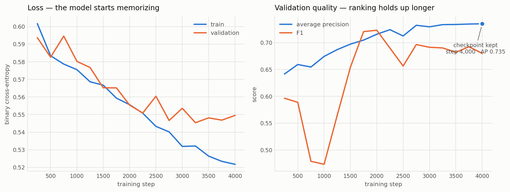

# TurnWave

**End-of-turn detection for voice agents, trained from scratch.**

Voice agents today decide "has the caller finished speaking?" with a fixed silence
timeout (300–700 ms). Too short and the agent interrupts mid-thought; too long and
every exchange feels laggy. Production stacks are replacing that timeout with
learned turn-taking models — but the open references each cover only half the
signal: [LiveKit's turn-detector](https://huggingface.co/livekit/turn-detector)
is text-only (semantic completeness), Pipecat's smart-turn is audio-only
(prosody). TurnWave trains **both branches from scratch and fuses them**.

```
audio (last ~2s) ──▶ log-mel spectrogram ──▶ CNN encoder ─────┐
                                                              ├─▶ fusion ─▶ P(turn complete)
transcript tail ──▶ BPE ──▶ causal transformer (from scratch) ┘      <50 ms CPU inference
```

Every layer is hand-written in PyTorch — RoPE, RMSNorm, SwiGLU, causal attention,
the training loop, the metrics. No HF `Trainer`, no pretrained weights.

## Status

- [x] **Phase 0 — scaffold**: uv project, package layout, data builders
- [x] **Phase 1 — text branch**: BPE tokenizer + 6.92M-param causal transformer
      over the transcript tail (with previous-turn context), trained on DailyDialog
      complete-vs-truncated pairs — **test F1 0.838, AP 0.889** (see Results)
- [x] **Phase 2 — acoustic branch**: log-mel front end written from scratch
      (`torch.stft` + a hand-built mel filterbank) and a 3.49M-param CNN over it,
      trained on real pauses in real speech — **test AP 0.741**
- [x] **Phase 3 — fusion + deployment**: fused model over both frozen branches —
      **test AP 0.767, beating both branches**; 9.1 ms CPU inference
- [x] **Phase 4 — benchmark adapter**: plugs into LiveKit's official eot-bench
      harness, so our row is computed by their code — *adapter done, run pending*
- [ ] **Phase 4b** — live LiveKit agent demo
- [ ] **Phase 5 — Indic multilingual**: Hindi + more via Sarvam-generated data

## Results — Phase 1 (text branch)

Held-out test set: 15,086 examples drawn from DailyDialog's own test dialogues,
so no utterance appears in training.

| | acc | precision | recall | F1 | AP |
|---|---|---|---|---|---|
| majority class | 0.513 | 0.513 | 1.000 | 0.678 | 0.513 |
| cue-word heuristic | 0.690 | 0.637 | 0.921 | 0.753 | 0.624 |
| **TurnWave text model** | **0.832** | **0.827** | **0.849** | **0.838** | **0.889** |

6.92M parameters, 6,000 steps on a Colab T4 (~50 min), batch size 256, AdamW with
warmup + cosine decay. Best validation AP 0.895.

Average precision is the metric to read here: the cue-word heuristic reaches
decent recall by guessing "complete" for most inputs, but ranks poorly (AP 0.624)
because it cannot tell a confident ending from a marginal one. The model's AP of
0.889 means its probability estimates are usable as a *threshold* in a live
pipeline, which is the entire point — a turn detector has to expose a tunable
latency/interruption tradeoff, not just a hard label.



**Honest note on overfitting.** Training loss falls from 0.526 to 0.093 while
validation loss bottoms out at step 1,750 (0.380) and then climbs to 0.649 —
the two curves cross around step 1,000 and never come back. The 6,000-step
budget is plainly larger than 170k examples of this difficulty support.

The interesting part is that the two panels disagree about *when* the run goes
bad. Validation loss turns at ~1,750, but validation AP keeps improving to 0.895
at step 3,250 and only then drifts to 0.880. That gap is not noise: cross-entropy
punishes overconfidence, average precision only cares about ranking. The model
becomes miscalibrated — right about the ordering, too sure of itself about the
margin — well before it becomes wrong. For a turn detector, ranking is what a
threshold consumes, so AP is the honest early-stopping signal here and
`best.pt` selects on it (step 3,250, not step 6,000).

Two fixes, in order of value: Phase 2's acoustic branch adds signal a text-only
model fundamentally cannot recover — prosody disambiguates the truncations that
are accidentally complete phrases, which is precisely the label noise capping
this branch. Failing that, stronger regularization plus early stopping on AP is
the cheap text-only answer.

## Results — the ablation

6,000 held-out examples (3,390 turn-final, 2,610 mid-turn), every model scored on
**the same examples**, so each row differs only by what the model can see:

| | acc | precision | recall | F1 | AP |
|---|---|---|---|---|---|
| majority class | 0.565 | 0.565 | 1.000 | 0.722 | 0.565 |
| cue-word heuristic | 0.544 | 0.564 | 0.853 | 0.679 | 0.565 |
| text only | 0.595 | 0.611 | 0.780 | 0.685 | 0.633 |
| audio only | 0.644 | 0.697 | 0.653 | 0.674 | 0.741 |
| **fused (text + audio)** | **0.669** | **0.709** | **0.702** | **0.706** | **0.767** |

**Fusion beats both branches** — +0.026 AP over audio alone, +0.134 over text
alone. That is the claim this project was built to test, and it held: prosody
carries end-of-turn information the transcript does not, and the two combine.



Deployment, measured on one CPU thread:

| model | fp32 | INT8 | ship | size |
|---|---|---|---|---|
| text | 3.64 ms | **3.11 ms** | INT8 | 7.2 MB |
| audio | **4.60 ms** | 31.24 ms | fp32 | 14.0 MB |
| fused | **9.10 ms** | 35.35 ms | fp32 | 42.4 MB |

The fused detector answers in **9.1 ms**, five times inside the 50 ms budget, with
ONNX-vs-PyTorch parity at 1.2e-07.

### What the numbers say that the table does not

**The audio branch is under-trained, not overfit.** Its best AP landed on the
final step (4,000) with train and validation loss almost together (0.522 vs
0.550) — the opposite of Phase 1's text branch, which diverged after step 1,750.
The CNN had not stopped learning when the budget ran out, so more steps and more
data are the obvious next lever. The 0.741 here is a floor, not a ceiling.

**Text scores 0.633 here but 0.889 on DailyDialog, and that gap is a property of
the data, not a regression.** This corpus is isolated utterances: the `messages`
field holds a single user turn, so the text branch runs with no dialogue context,
while on DailyDialog it had the previous turn to condition on. Reporting only the
0.889 would be flattering the model with a different task. The honest reading is
that a text-only detector degrades sharply without conversational context, which
is exactly the condition a fused model is meant to cover.

**Audio beat text on this data (0.741 vs 0.633)** — the reverse of what the
project assumed at the outset, and a direct consequence of the point above.

## Phase 2 — the acoustic branch

Phase 1's error analysis said what was needed: the text model is capped by
truncations that are *accidentally complete phrases*, and no amount of text fixes
that. So the acoustic branch listens for what the transcript cannot carry — the
speaker who holds pitch level and trails energy into a pause is not finished; the
one who drops pitch and closes is.

**Training examples come from real pauses, not synthetic truncations.** Each
utterance in the corpus is annotated with every pause and with word-level
timings. The final pause ended the turn; the earlier ones are mid-turn
hesitations a good agent listens through. So one utterance yields one positive
and several negatives, and because the word timings are exact, the transcript at
each cut point is exact too — audio and text are aligned with no approximation.

**Everything is still from scratch.** The log-mel front end is `torch.stft` plus a
hand-built mel filterbank; there is no torchaudio and no librosa. The CNN is
randomly initialised. Pipecat's smart-turn uses a pretrained Whisper encoder and
will likely score better for it — the benchmark will report that gap rather than
hide it.

Two engineering findings from this phase are worth reading even if the numbers
are not in yet:

- **The filterbank had a silent bug.** Rounding mel edges onto FFT bin indices
  leaves the lowest filters empty, so the model never sees the bottom of the
  spectrum — where pitch lives. The loss still falls; you just never find out.
  Building the triangles on a continuous frequency axis fixes it, and the tests
  assert every filter is non-empty. Those same assertions forced the window from
  25 ms to 32 ms, since at 40 Hz bin spacing the narrowest filters could not
  overlap.
- **INT8 is not a free win.** Dynamic quantization rewrites MatMul, so it makes
  the transformer 1.9× faster and the conv-heavy audio branch 4.4× *slower*. The
  export tool measures both and recommends one instead of assuming. Separately,
  the CNN's first design convolved 64 channels at full resolution: 2.3 GMACs and
  518 ms per call, ten times over budget for something that fires on every pause.
  A stride-2 stem, with the width moved to the cheap end, brings it to 4.5 ms at
  the same parameter count.

Run it: `notebooks/colab_phase2.ipynb`.

## Benchmarking against published models

`turnwave/eot_bench_adapter.py` plugs into [LiveKit's eot-bench
harness](https://github.com/livekit/eot-bench), which publishes a leaderboard on
real human-to-agent audio with VAD, SmartTurn v3.2 and LiveKit Turn Detector v1
already scored.

It is an adapter rather than our own metric script on purpose. eot-bench's
definitions are subtle enough that reimplementing them from the column headings
would produce numbers that *look* comparable and are not: a false cutoff is
counted per mid-turn pause rather than per row, "@300 ms" is a budget on **mean
latency** rather than a wait threshold, and latency runs from the start of the
final silence and includes the policy's own action delay. Running their code
removes the question. The adapter declares `score_point = 0.2` to match what
LiveKit's own model and SmartTurn use, and reports English only — the model is
trained on English, and claiming the other 13 languages would be reporting noise.

```bash
pip install git+https://github.com/livekit/eot-bench
export TURNWAVE_ONNX=checkpoints/onnx/fusion_eot.onnx
export TURNWAVE_TOKENIZER=checkpoints/tokenizer/spm.model
eot-harness predict --path livekit/eot-bench-data --name all --split validation \
    --adapter turnwave.eot_bench_adapter:TurnWaveAdapter --output-dir output
```

The row to fill:

| model | false cutoffs @300 ms | @600 ms | latency @5% cutoff |
|---|---|---|---|
| VAD baseline | 55.6% | 21.7% | 1600 ms |
| SmartTurn v3.2 | 35.2% | 14.8% | 1051 ms |
| LiveKit Turn Detector v1 | 9.9% | 4.5% | 543 ms |
| **TurnWave** | pending | pending | pending |

Setting expectations honestly: SmartTurn starts from a pretrained Whisper encoder
and LiveKit's model is a fine-tuned 0.5B LLM distilled from a 7B teacher. TurnWave
is ~10M parameters trained from scratch on a fraction of the data. The point of
the table is to measure the gap and explain it, not to win it.

## Quickstart

```bash
uv sync
uv run python scripts/build_text_dataset.py --out data/text
uv run python -m turnwave.tokenizer data/text/corpus.txt checkpoints/tokenizer
uv run python -m turnwave.train \
    --train data/text/train.jsonl --val data/text/validation.jsonl \
    --tokenizer checkpoints/tokenizer/spm.model --out checkpoints/text_eot
uv run python -m turnwave.evaluate \
    --ckpt checkpoints/text_eot/best.pt \
    --tokenizer checkpoints/tokenizer/spm.model --data data/text/test.jsonl
uv run python scripts/plot_training.py checkpoints/text_eot/log.csv
```

CPU-only machines: add `--limit 20000 --steps 300` to `turnwave.train` for a smoke
run; real training is a few GPU-hours on a free Colab T4
(`notebooks/colab_train.ipynb`).

Try it:

```bash
uv run python -m turnwave.predict "i want a large pepperoni and" \
    --context "what would you like to order" \
    --ckpt checkpoints/text_eot/best.pt --tokenizer checkpoints/tokenizer/spm.model
```

## Design decisions

- **ASR-normalized text.** Training text is lowercased and stripped of
  punctuation because that is what streaming ASR emits. Leaving punctuation in
  lets the model key on terminal periods it will never see in production.
- **Truncation negatives.** Negatives are real utterances cut at random word
  boundaries. Some cuts are accidentally complete phrases — irreducible label
  noise for a text-only model, and precisely the ambiguity the acoustic branch
  (falling pitch, trailing energy) resolves in Phase 3.
- **Classification at the last token.** Right padding + causal mask means pads
  can never influence real tokens, so the last real token's hidden state is a
  clean sequence summary (verified by `tests/test_model.py`).
- **Dialogue-level splits.** Train/val/test split by dialogue, following
  DailyDialog's own splits — no utterance appears in two splits.

## Tests

```bash
uv run pytest
```

Covers: dataset determinism and truncation invariants, model shapes, a causality
check (future tokens cannot affect past hidden states), padding leak check, and
a CPU training smoke test asserting the loss actually falls.
