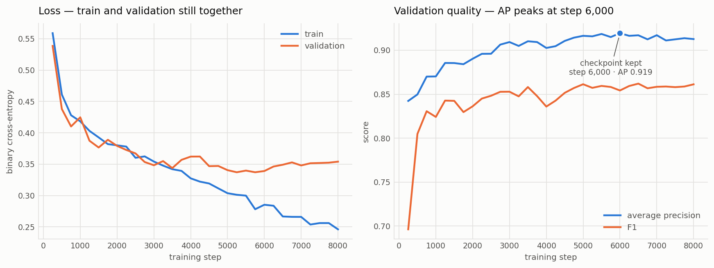

# TurnWave

[](https://github.com/Nikhils-G/turnwave/actions/workflows/tests.yml)
[](LICENSE)
[](https://huggingface.co/Nikhil-09/turnwave)

**End-of-turn detection for voice agents, trained from scratch.**

Voice agents today decide "has the caller finished speaking?" with a fixed silence
timeout (300–700 ms). Too short and the agent interrupts mid-thought; too long and
every exchange feels laggy. Production stacks are replacing that timeout with
learned turn-taking models — but the open references each cover only half the
signal: [LiveKit's turn-detector](https://huggingface.co/livekit/turn-detector)
is text-only (semantic completeness), Pipecat's smart-turn is audio-only
(prosody). TurnWave trains **both branches from scratch and fuses them**.

```
audio (last ~2s) ──▶ log-mel spectrogram ──▶ CNN encoder ─────┐
                                                              ├─▶ fusion ─▶ P(turn complete)
transcript tail ──▶ BPE ──▶ causal transformer (from scratch) ┘      <50 ms CPU inference
```

Every layer is hand-written in PyTorch — RoPE, RMSNorm, SwiGLU, causal attention,
the training loop, the metrics. No HF `Trainer`, no pretrained weights.

## Status

- [x] **Phase 0 — scaffold**: uv project, package layout, data builders
- [x] **Phase 1 — text branch**: BPE tokenizer + 6.92M-param causal transformer
      over the transcript tail (with previous-turn context), trained on DailyDialog
      complete-vs-truncated pairs — **test F1 0.847, AP 0.888** (see Results)
- [x] **Phase 2 — acoustic branch**: log-mel front end written from scratch
      (`torch.stft` + a hand-built mel filterbank) and a 3.49M-param CNN over it,
      trained on real pauses in real speech — **test AP 0.938**
- [x] **Phase 3 — fusion + deployment**: fused model over both frozen branches —
      **test AP 0.945, beating both branches**; 9.4 ms CPU inference
- [x] **Phase 4 — independent benchmark**: scored by LiveKit's own eot-bench
      harness. Exposed a generalization failure the in-domain numbers had hidden
      completely — AP 0.945 in-domain, AUC 0.563 on real conversation
- [x] **Phase 5 — the fix**: retrained the acoustic branch on conversational data.
      **AUC 0.563 → 0.770**, and it now beats the VAD baseline on every benchmark
      metric. Training is also resumable now, so a dead session costs 249 steps
- [ ] **Phase 6** — transcribe the conversational corpus so fusion can be retrained
      and re-benchmarked; live LiveKit agent demo
- [ ] **Phase 5 — Indic multilingual**: Hindi + more via Sarvam-generated data

## Results — measured on an independent benchmark

Scored by [LiveKit's eot-bench](https://github.com/livekit/eot-bench) harness, on
real human-to-agent conversations, using their code and their published baselines.
Lower is better in the first two columns; **bold marks the best in each column.**

| model | false cutoffs @300 ms ↓ | @600 ms ↓ | latency @5% cutoff ↓ |
|---|---|---|---|
| VAD baseline | 55.6% | 21.7% | 1600 ms |
| **TurnWave audio branch** | **42.1%** | **17.2%** | **1195 ms** |
| SmartTurn v3.2 | 35.2% | 14.8% | 1051 ms |
| LiveKit Turn Detector v1 | **9.9%** | **4.5%** | **543 ms** |

TurnWave sits between the VAD baseline and SmartTurn. It is behind both production
models, and the comparison is not a fair fight: SmartTurn starts from a pretrained
Whisper encoder, LiveKit's is a fine-tuned 0.5B LLM distilled from a 7B teacher.
This is a 3.49M-parameter CNN trained from random initialisation, and it runs in
**4.8 ms on one CPU thread**.

### How the first version of this model failed, and what fixed it

The interesting result is not that row. It is what the benchmark caught before it.

The Phase 4 model scored **AP 0.945** on its own held-out test set. On eot-bench it
scored **AUC 0.563** — barely above random — and the policy sweep chose thresholds
of 0.0 and 1.0, meaning *ignore the model entirely*, landing exactly on the VAD
baseline. A model that looked excellent by every number we had generated ourselves
was worth nothing on real conversation.

The cause was the training corpus, not the architecture. `Scicom-intl/semantic-vad-eot`
derives from a dataset whose own card declares
`task_categories: [automatic-speech-recognition, text-to-speech]`. **It is read
speech.** Its pauses are reading hesitations and sentence boundaries; each row held
one utterance, so there was never a conversation in it. The model had learned
*"has this sentence finished being read aloud"* — a real skill, and the wrong task.

Phase 5 changed **only the training data**, to `pipecat-ai/smart-turn-data-v3.2`
(human-authored end-of-turn labels from real voice-agent contexts). Same window,
same architecture, same step budget, so the difference is attributable:

| on eot-bench | Phase 4 (read speech) | Phase 5 (conversational) |
|---|---|---|
| AUC | 0.563 | **0.770** |
| AP | 0.472 | **0.602** |
| median p(eot) — true turn ends | 0.42 | **0.78** |
| median p(eot) — mid-turn pauses | 0.29 | **0.24** |
| false cutoffs @300 ms | 55.6% (= VAD) | **42.1%** |

The clearest evidence is what the sweep does with the model. In Phase 4 it picked
degenerate thresholds and ignored it; now it picks 0.07–0.42 with detection rates
of 80–96%. The model went from decoration to load-bearing.

**The lesson, stated plainly: our own test set was measuring the wrong thing, and
no amount of it would have revealed that.** Only an independent benchmark on data
we did not build could. That is why the eot-bench adapter exists, and why the
in-domain numbers below are reported as diagnostics rather than as results.

## In-domain diagnostics (not results)

These come from held-out splits of our *own* training corpora. Phase 4's
0.945 below is exactly the number that proved misleading, and it is kept here
as the evidence for the point above rather than as a claim about the model.

### Phase 1 text branch (DailyDialog)

Held-out test set: 15,086 examples drawn from DailyDialog's own test dialogues,
so no utterance appears in training.

| | acc | precision | recall | F1 | AP |
|---|---|---|---|---|---|
| majority class | 0.513 | 0.513 | 1.000 | 0.678 | 0.513 |
| cue-word heuristic | 0.690 | 0.637 | 0.921 | 0.753 | 0.624 |
| **TurnWave text model** | **0.833** | **0.800** | **0.898** | **0.847** | **0.888** |

6.92M parameters, 3,500 steps on a Colab T4 (~30 min), batch size 256, AdamW with
warmup + cosine decay. Best validation AP 0.894 at step 1,250.

The budget was cut from 6,000 steps to 3,500 on the strength of the first run's
curves, and the shorter run scored *better* on the test set (F1 0.847 vs 0.838)
for half the compute — the last 2,500 steps had been buying nothing but
overconfidence.

Average precision is the metric to read here: the cue-word heuristic reaches
decent recall by guessing "complete" for most inputs, but ranks poorly (AP 0.624)
because it cannot tell a confident ending from a marginal one. The model's AP of
0.889 means its probability estimates are usable as a *threshold* in a live
pipeline, which is the entire point — a turn detector has to expose a tunable
latency/interruption tradeoff, not just a hard label.


**Honest note on overfitting.** Training loss falls from 0.526 to 0.093 while
validation loss bottoms out at step 1,750 (0.380) and then climbs to 0.649 —
the two curves cross around step 1,000 and never come back. The 6,000-step
budget is plainly larger than 170k examples of this difficulty support.

The interesting part is that the two panels disagree about *when* the run goes
bad. Validation loss turns at ~1,750, but validation AP keeps improving to 0.895
at step 3,250 and only then drifts to 0.880. That gap is not noise: cross-entropy
punishes overconfidence, average precision only cares about ranking. The model
becomes miscalibrated — right about the ordering, too sure of itself about the
margin — well before it becomes wrong. For a turn detector, ranking is what a
threshold consumes, so AP is the honest early-stopping signal here and
`best.pt` selects on it (step 3,250, not step 6,000).

Two fixes, in order of value: Phase 2's acoustic branch adds signal a text-only
model fundamentally cannot recover — prosody disambiguates the truncations that
are accidentally complete phrases, which is precisely the label noise capping
this branch. Failing that, stronger regularization plus early stopping on AP is
the cheap text-only answer.

### Phase 4 ablation — text, audio, and fusion (read-speech corpus)

7,817 held-out examples, every model scored on **the same examples**, so each row
differs only by what the model can see:

| | acc | precision | recall | F1 | AP |
|---|---|---|---|---|---|
| majority class | 0.640 | 0.640 | 1.000 | 0.780 | 0.636 |
| cue-word heuristic | 0.582 | 0.627 | 0.853 | 0.723 | 0.625 |
| text only | 0.598 | 0.670 | 0.732 | 0.699 | 0.683 |
| audio only | 0.770 | 0.907 | 0.714 | 0.799 | 0.938 |
| **fused (text + audio)** | **0.802** | **0.888** | **0.791** | **0.837** | **0.945** |

Fusion beat both branches on this corpus. That finding stands as far as it goes,
but the corpus turned out to be the wrong task, so it awaits a rerun once the
conversational data has transcripts (see Phase 6 below).


Deployment, measured on one CPU thread:

| model | fp32 | INT8 | ship | size |
|---|---|---|---|---|
| text | 6.10 ms | **5.02 ms** | INT8 | 7.2 MB |
| audio | **4.52 ms** | 33.05 ms | fp32 | 14.0 MB |
| fused | **9.35 ms** | 37.02 ms | fp32 | 42.4 MB |

The fused detector answers in **9.4 ms** with ONNX-vs-PyTorch parity at 2.4e-07.
End to end on this laptop's CPU — log-mel extraction, tokenization and inference —
p95 is **47 ms**, inside the 50 ms budget.

INT8 is not applied blindly. Dynamic quantization rewrites MatMul, so it speeds up
the transformer (1.2×) and *slows down* both conv-containing graphs (7.3× and 4.0×
worse). The export tool measures both variants and recommends one.

### Reading these numbers honestly

**AP went from 0.767 to 0.945 between runs, and that is not a like-for-like
improvement.** Three things changed at once:

1. The training set doubled — 60k examples from 33k conversations, to 120k from 76k.
2. The audio budget doubled, 4,000 steps to 8,000 (stopped at 4,250 when the free
   Colab allowance ran out; AP had already plateaued at 0.932).
3. **The task itself got easier.** Moving the decision point 0.2 s into each pause
   required dropping pauses shorter than that, and those very short pauses were the
   hardest negatives — barely pauses at all. The test set changed with the training
   set.

Point 3 means the two numbers are not directly comparable. The defensible claim is
"AP ~0.94 on the eot-bench-aligned task", not "+0.18 improvement". The eot-bench
run is what settles it, because that is scored on data we did not build.

**Fusion's margin narrowed as the audio branch got stronger** — +0.026 AP over the
best branch in the first run, +0.007 here. On F1 the gain is larger (+0.038), since
fusion trades a little precision for markedly better recall. A fused model earns
less when one branch is already carrying most of the signal.

**Audio now clearly beats text** (AP 0.938 vs 0.683), the reverse of the project's
opening assumption. The text branch scores 0.888 on DailyDialog and 0.683 here
because this corpus is isolated utterances with no dialogue context — it is running
without the previous turn it was designed to condition on. That is a limitation of
the evaluation data, not a regression, and it is precisely the condition a fused
model is meant to cover.


### Phase 5 acoustic branch (conversational corpus)

100,000 clips from `smart-turn-data-v3.2`, 8,000 steps on a Kaggle T4.
Best validation **AP 0.919** at step 6,000.



Not comparable to the 0.938 above — different corpus, different task. The number
that counts is the benchmark row at the top.

## Phase 2 — the acoustic branch

Phase 1's error analysis said what was needed: the text model is capped by
truncations that are *accidentally complete phrases*, and no amount of text fixes
that. So the acoustic branch listens for what the transcript cannot carry — the
speaker who holds pitch level and trails energy into a pause is not finished; the
one who drops pitch and closes is.

**Training examples come from real pauses, not synthetic truncations.** Each
utterance in the corpus is annotated with every pause and with word-level
timings. The final pause ended the turn; the earlier ones are mid-turn
hesitations a good agent listens through. So one utterance yields one positive
and several negatives, and because the word timings are exact, the transcript at
each cut point is exact too — audio and text are aligned with no approximation.

**Everything is still from scratch.** The log-mel front end is `torch.stft` plus a
hand-built mel filterbank; there is no torchaudio and no librosa. The CNN is
randomly initialised. Pipecat's smart-turn uses a pretrained Whisper encoder and
will likely score better for it — the benchmark will report that gap rather than
hide it.

Two engineering findings from this phase are worth reading even if the numbers
are not in yet:

- **The filterbank had a silent bug.** Rounding mel edges onto FFT bin indices
  leaves the lowest filters empty, so the model never sees the bottom of the
  spectrum — where pitch lives. The loss still falls; you just never find out.
  Building the triangles on a continuous frequency axis fixes it, and the tests
  assert every filter is non-empty. Those same assertions forced the window from
  25 ms to 32 ms, since at 40 Hz bin spacing the narrowest filters could not
  overlap.
- **INT8 is not a free win.** Dynamic quantization rewrites MatMul, so it makes
  the transformer 1.9× faster and the conv-heavy audio branch 4.4× *slower*. The
  export tool measures both and recommends one instead of assuming. Separately,
  the CNN's first design convolved 64 channels at full resolution: 2.3 GMACs and
  518 ms per call, ten times over budget for something that fires on every pause.
  A stride-2 stem, with the width moved to the cheap end, brings it to 4.5 ms at
  the same parameter count.

Run it: `notebooks/colab_phase2.ipynb`.

## Benchmarking against published models

`turnwave/eot_bench_adapter.py` plugs into [LiveKit's eot-bench
harness](https://github.com/livekit/eot-bench), which publishes a leaderboard on
real human-to-agent audio with VAD, SmartTurn v3.2 and LiveKit Turn Detector v1
already scored.

It is an adapter rather than our own metric script on purpose. eot-bench's
definitions are subtle enough that reimplementing them from the column headings
would produce numbers that *look* comparable and are not: a false cutoff is
counted per mid-turn pause rather than per row, "@300 ms" is a budget on **mean
latency** rather than a wait threshold, and latency runs from the start of the
final silence and includes the policy's own action delay. Running their code
removes the question. The adapter declares `score_point = 0.2` to match what
LiveKit's own model and SmartTurn use, and reports English only — the model is
trained on English, and claiming the other 13 languages would be reporting noise.

```bash
pip install git+https://github.com/livekit/eot-bench
export TURNWAVE_ONNX=checkpoints/onnx/fusion_eot.onnx
export TURNWAVE_TOKENIZER=checkpoints/tokenizer/spm.model
eot-harness predict --path livekit/eot-bench-data --name all --split validation \
    --adapter turnwave.eot_bench_adapter:TurnWaveAdapter --output-dir output
```

The row to fill:

| model | false cutoffs @300 ms | @600 ms | latency @5% cutoff |
|---|---|---|---|
| VAD baseline | 55.6% | 21.7% | 1600 ms |
| SmartTurn v3.2 | 35.2% | 14.8% | 1051 ms |
| LiveKit Turn Detector v1 | 9.9% | 4.5% | 543 ms |
| **TurnWave** | pending | pending | pending |

Setting expectations honestly: SmartTurn starts from a pretrained Whisper encoder
and LiveKit's model is a fine-tuned 0.5B LLM distilled from a 7B teacher. TurnWave
is ~10M parameters trained from scratch on a fraction of the data. The point of
the table is to measure the gap and explain it, not to win it.

## Quickstart

```bash
uv sync
uv run python scripts/build_text_dataset.py --out data/text
uv run python -m turnwave.tokenizer data/text/corpus.txt checkpoints/tokenizer
uv run python -m turnwave.train \
    --train data/text/train.jsonl --val data/text/validation.jsonl \
    --tokenizer checkpoints/tokenizer/spm.model --out checkpoints/text_eot
uv run python -m turnwave.evaluate \
    --ckpt checkpoints/text_eot/best.pt \
    --tokenizer checkpoints/tokenizer/spm.model --data data/text/test.jsonl
uv run python scripts/plot_training.py checkpoints/text_eot/log.csv
```

CPU-only machines: add `--limit 20000 --steps 300` to `turnwave.train` for a smoke
run; real training is a few GPU-hours on a free Colab T4
(`notebooks/colab_train.ipynb`).

Try it:

```bash
uv run python -m turnwave.predict "i want a large pepperoni and" \
    --context "what would you like to order" \
    --ckpt checkpoints/text_eot/best.pt --tokenizer checkpoints/tokenizer/spm.model
```

## Design decisions

- **ASR-normalized text.** Training text is lowercased and stripped of
  punctuation because that is what streaming ASR emits. Leaving punctuation in
  lets the model key on terminal periods it will never see in production.
- **Truncation negatives.** Negatives are real utterances cut at random word
  boundaries. Some cuts are accidentally complete phrases — irreducible label
  noise for a text-only model, and precisely the ambiguity the acoustic branch
  (falling pitch, trailing energy) resolves in Phase 3.
- **Classification at the last token.** Right padding + causal mask means pads
  can never influence real tokens, so the last real token's hidden state is a
  clean sequence summary (verified by `tests/test_model.py`).
- **Dialogue-level splits.** Train/val/test split by dialogue, following
  DailyDialog's own splits — no utterance appears in two splits.

## Tests

```bash
uv run pytest
```

Covers: dataset determinism and truncation invariants, model shapes, a causality
check (future tokens cannot affect past hidden states), padding leak check, and
a CPU training smoke test asserting the loss actually falls.
